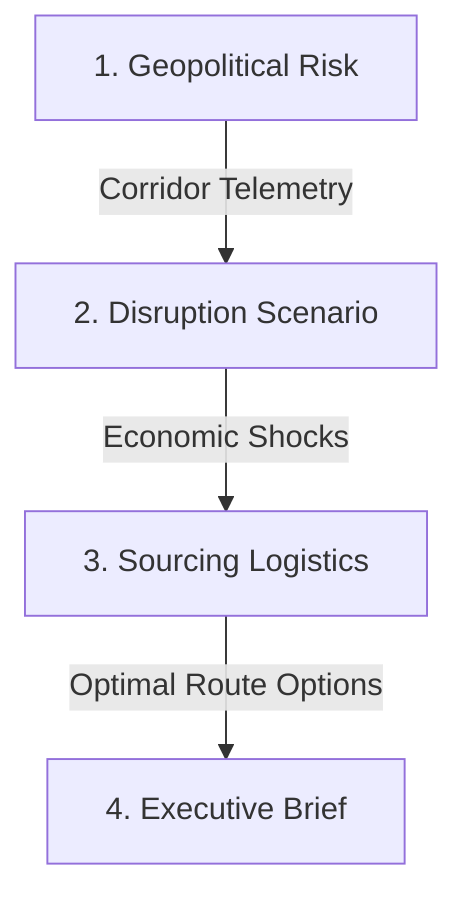

# Sentinel-47 Command Center — Complete Codebase & Feature Guide

Welcome to the ultimate detailed walkthrough of **Sentinel-47 Command Control**! This document explains every single file, logic loop, formula, UI transition, and API endpoint in simple terms so that even a newbie developer can master the codebase.

---

## 🌟 The Big Picture: What is Sentinel-47?

Sentinel-47 is a **next-generation crisis control center** designed to stress-test India's crude oil supply chain against geopolitical conflicts. Since India imports about 88% of its crude, any threat to transit choke points (like the Strait of Hormuz, Red Sea, or Suez Canal) can cause massive price spikes and fuel shortages.

The system helps commanders:
1. Scan for chokepoint threat levels (LIVE data feed).
2. Stress-test domestic capacity against shock presets or custom drops.
3. Find and rank alternative sourcing routes dynamically.
4. Auto-compile a printable briefing memo ready for ministerial signatures.

---

## 📁 Repository Directory Structure

Here is a map of the folders and files in the repository:

```text
d:/et_ai/
├── app/                        # Next.js App Router folders
│   ├── api/                    # API Route endpoints (mock & Gemini LLM)
│   │   ├── memo/               # Synthesis endpoint for decision directives memo
│   │   ├── procurement/        # Sourcing evaluator and scorer endpoint
│   │   ├── risk/               # Geopolitical corridor risk endpoint
│   │   └── scenario/           # Cascading stress-model calculator endpoint
│   ├── globals.css             # Main styling, themes, glassmorphism, scanlines
│   ├── layout.tsx              # Root HTML structure and font setup
│   └── page.tsx                # Main Dashboard container & top telemetry header
├── components/                 # Reusable React components
│   ├── AnimatedNumber.tsx      # Smooth number counter transition
│   ├── ExecutiveMemo.tsx       # Module 4: Formal printable briefing memo
│   ├── ProcurementOrchestrator.tsx # Module 3: Sourcing logistics debate & cards
│   ├── RiskIntelligence.tsx    # Module 1: Telemetry map & terminal signals feed
│   ├── RiskMap.tsx             # Interactive SVG map displaying chokepoint risks
│   └── ScenarioModeller.tsx     # Module 2: Stress-test controllers & metric ranges
├── package.json                # Project dependencies, scripts, metadata
└── tsconfig.json               # TypeScript compiler config guidelines
```

---

## ⚙️ How the 4 Core Modules Work

The application is structured into four sequential modules that simulate an operational cascade:



---

## 🔍 Module 1: Geopolitical Risk Intelligence

- **Component file**: `components/RiskIntelligence.tsx`
- **Helper file**: `components/RiskMap.tsx`
- **Main State**: `corridors` (stores risk percentages for Suez, Hormuz, Red Sea) and `signals` (stores alert lists).

### Minute Features:
1. **Interactive SVG Map (`RiskMap.tsx`)**:
   - Renders a tactical vector world map in dark colors.
   - Shows chokepoints as nodes with **pulsing outer rings**. Red/orange circles highlight zones where risk exceeds standard limits.
   - Draws glowing dotted dashed lines for active ocean tanker lanes connecting source countries to India.
2. **Terminal Signals Feed**:
   - Mimics a live intelligence console feed.
   - Renders telemetry signals with confidence scores (e.g., `Confidence: 94%`) and event descriptions (e.g., "Corridor threat probability crossed Warning threshold").
   - Scrolls smoothly to the top when a new signal lands.
3. **Brent price panel**:
   - Displays live Brent crude prices (default: `$74.50/bbl`).
   - Adapts color depending on whether prices are estimated or live.

---

## 🔍 Module 2: Disruption Scenario Modeller

- **Component file**: `components/ScenarioModeller.tsx`
- **Main State**: `activeScenarioId` (Baseline, Hormuz, OPEC+, Red Sea, Replay 2025, or Custom).

### Minute Features:
1. **Shock Presets**:
   - Clicking a preset scenario instantly triggers the cascade pipeline (`triggerFullPipeline` in `app/page.tsx`).
   - The presets update refinery capacities, Brent prices, and SPR reserves.
2. **Custom Capacity Slider**:
   - When the user selects "Custom Simulator", a manual range input slider appears.
   - Sliding the drop percentage triggers live recalibrations in real-time.
3. **Modeled Metrics as Ranges (Uncertainty Spread)**:
   - To reflect realistic modeling uncertainty, metrics display as ranges (with a uniform **±15% spread**):
     - **Refinery Run Rate**: Range calculated based on ±15% of the run-rate drop to respect the 100% capacity limit at baseline (Formula: `[100 - maxDrop, 100 - minDrop]`).
     - **Fuel Price Shock**: Range of `[delta * 0.85, delta * 1.15]`.
     - **SPR Buffer Cover**: Range of `[days * 0.85, days * 1.15]` capped at 9.5.
     - **Quarterly GDP Drag**: Range of `[drag * 0.85, drag * 1.15]`.
   - Each card displays an inline **"MODELED RANGE"** status badge in gold.
4. **Shaded Band Visualizer Bars**:
   - Standard progress bars are modified to show a **shaded opacity-40 band** spanning from the minimum to the maximum computed values of the range.
   - A **thin 2px white line with neon outer glow** represents the point-estimate value ("most likely value") inside the band.
5. **Interactive Assumptions Grid**:
   - Explains the formulation boundaries (e.g. Suez fee increase assumptions).
   - Hovering over an assumption card highlights it in cyan and exposes a validation stamp.
   - Stated assumptions reference the original point-estimate numbers to remain mathematically consistent.

---

## 🔍 Module 3: Adaptive Procurement Orchestrator

- **Component file**: `components/ProcurementOrchestrator.tsx`
- **Main State**: `selectedRoute` (currently highlighted card index).

### Minute Features:
1. **Multi-Agent Reasoning Debate Panel**:
   - Features a collapsible visual panel labeled `"AGENTIC REASONING — SIMULATED STAKEHOLDER PRIORITIES"`.
   - Dynamically evaluates the top 3 sourcing logistics alternatives across two conflicting criteria:
     - **Cost Agent (Left / Blue)**: Reviews candidates to suggest paths with the lowest `pricePremium` (recommends discounts, accepting moderate costs).
     - **Security & Speed Agent (Right / Amber)**: Reviews paths to reject unsafe routes (>20 transit days) and favor low-risk drawdowns (SPR).
     - **Consensus Line (Bottom / Gold)**: Highlights the optimal choice by pulling details dynamically from the #1 ranked recommendation (`options[0]`).
2. **Staggered Reveal Timers**:
   - When loading options, the panel resets and animates step-by-step:
     1. Cost Agent lines appear first (**300ms**).
     2. Security Agent lines appear next (**600ms**).
     3. Consensus row appears last (**1000ms**).
   - Display terminal-style pulsing logs (e.g., "Cost Agent analyzing price metrics...") while calculations are compiling.
3. **Score Color Thresholds**:
   - Score badges render in three modes:
     - $\ge$ 85: Cyber-Green (`text-cyber-green border-cyber-green/30 bg-cyber-green/5`)
     - 70–84: Cyber-Amber (`text-cyber-amber border-cyber-amber/30 bg-cyber-amber/5`)
     - $<$ 70: Cyber-Red (`text-cyber-red border-cyber-red/30 bg-cyber-red/5`)
4. **Tactical Pricing conversions**:
   - Formats crude premiums in USD and converts them to INR (at a 1 USD = 83 INR rate) for detailed compliance (e.g. `+$2.20/bbl (+₹182.60/bbl)`).

---

## 🔍 Module 4: Executive Decision Memo Agent

- **Component file**: `components/ExecutiveMemo.tsx`
- **Main State**: `localCompiling` and `compileProgress`.

### Minute Features:
1. **Decision Latency Benchmark**:
   - Compares the active response performance of Sentinel-47 (decision compiled in milliseconds) against a legacy baseline pipeline response (stabilization latency modeled at 47 days).
   - Displays estimated Quarterly GDP Drag avoided as a green metric.
2. **Pulsing Compiler HUD**:
   - When triggering a pipeline refresh, the memo panel collapses into a loading screen displaying a compiling percentage bar (`0% to 100%`) using a 50ms interval timer.
3. ** ministerial Letterhead**:
   - Styled to match official Ministry of Petroleum documents with double-border divider rails and formal serif fonts.
   - Generates unique reference numbers (`S47-MOPNG-XXXX`).
4. **One-Click PDF/Print Isolation**:
   - Clicking "PRINT/PDF" calls `window.print()`.
   - Under the hood, CSS `@media print` rules hide all other dashboard panels, maps, menus, buttons, and navigation rails, rendering ONLY the clean document page on white background.

---

## 💡 The Top Telemetry Header & Resilience Index

- **Main File**: `app/page.tsx`
- **Pop-up State**: `showResiliencePopover`.

### Sentinel Resilience Index:
At the center of the top strip, a composite national score is calculated and displayed:
`INDIA RESILIENCE SCORE: {Value}`

1. **The Math (Weights sum to exactly 1.0)**:
   - **Corridor Risk** (Weight: `0.30` | LIVE): Normalized as `100 - avg_corridor_risk_pct`.
   - **SPR Depletion** (Weight: `0.30` | MODELED): Normalized as `(days_of_cover / 9.5) * 100`.
   - **Refinery Exposure** (Weight: `0.25` | MODELED): Normalized as `100 - refinery_run_rate_drop`.
   - **GDP Drag** (Weight: `0.15` | MODELED): Normalized against a max drag of 1.5% as `Math.max(0, 100 - (gdp_drag / 1.5) * 100)`.
   - *Comment near formula*: `"Methodology generalizes to any import-dependent economy or critical commodity by substituting corridor/reserve/GDP inputs — scoring structure is commodity-agnostic."*

2. **Color Badges**:
   - $\ge$ 70: Cyber-Green glow (`shadow-[0_0_12px_rgba(16,185,129,0.25)]`)
   - 40–69: Cyber-Amber glow (`shadow-[0_0_12px_rgba(245,158,11,0.25)]`)
   - $<$ 40: Cyber-Red glow (`shadow-[0_0_12px_rgba(239,68,68,0.25)]`)

3. **Breakdown popover HUD**:
   - Clicking the badge opens a glassmorphism popover showing progress bars for each of the 4 sub-scores.
   - Categorizes components as either **LIVE** (Corridor risk) or **MODELED** (Reserve, Refinery, GDP).

4. **Guided state tour loop**:
   - Renders a narrating overlay showing system logs as the tour advances over a 90-second timeline.
   - Synchronizes views by snapping between Tab 1 (Geopolitical Risk), Tab 2 (Scenario Modeller), Tab 3 (Sourcing Logistics), and Tab 4 (Executive Brief) automatically.

---

## 🛠️ Developer Verification & Build Commands

1. **Verify package dependencies**:
   ```bash
   npm i
   ```
2. **Start the local server**:
   ```bash
   npm run dev
   ```
3. **Verify compiler safety**:
   ```bash
   npm run build
   ```
   This script runs compiler type checks and outputs bundles.
